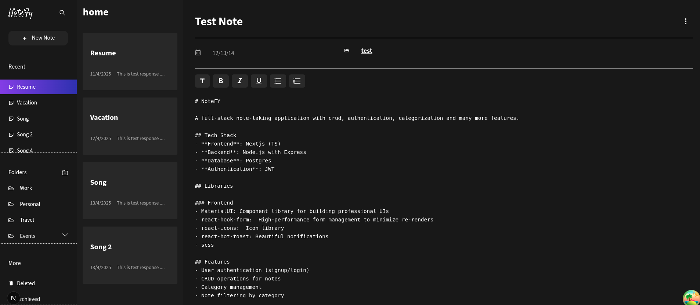

# NoteFY

A full-stack note-taking application with rich text editing, folder-based organization, and secure authentication. Built with modern technologies across both frontend and backend, NoteFY focuses on usability, performance, and security.



## Tech Stack

### Frontend

- **Next.js (TypeScript)** – Server-rendered React framework
- **Material-UI (MUI)** – Customizable UI components with built-in theming
- **React Hook Form** – Performant form handling
- **React Query (@tanstack/react-query)** – Server state management and caching
- **SCSS** – Modular and advanced styling

### Backend

- **Node.js + Express** – Scalable and minimalist web server
- **Prisma** – Type-safe ORM for PostgreSQL
- **PostgreSQL** – Relational database
- **JWT** – Secure authentication
- **SendGrid** – Email verification system
- **Bcrypt** – Password hashing

## Key Features

- **Rich Text Notes** – Create and format notes with advanced editing tools
- **Note Organization** – Categorize notes using folders and tags
- **Authentication** – Secure login/signup using JWT and email verification
- **Error Handling** – Clear and contextual error messages across server
- **Validation** – Zod-based validation on both frontend and backend
- **Responsive Design** – Adaptable to all device sizes
- **RESTful API** – Follows best practices for route structure and communication
- **Pagination & Filtering** – Handled at the server level for scalability

## Development Setup

1. **Clone the repository** using ssh

   ```bash
   git clone git@github.com:Sachyamdh/lf-assignment.git
   cd lf-assignment
   ```

2. **Start the development environment**  
   Run the following command to start the Docker container, the server, and the client:

   ```bash
   ./start.sh
   ```

3. **Install dependencies**

   - For the client and server, install dependencies using Yarn:

   ```bash
   yarn install
   ```

4. **Environment Setup**  
   Ensure that all necessary environment variables are set for local development.  
   Example `.env` setup:

   ```plaintext
   DATABASE_URL=your_database_url
   JWT_SECRET=your_jwt_secret
   SENDGRID_API_KEY=your_sendgrid_api_key
   .
   .
   ```

5. **Run the application**  
   After starting the Docker container, the app will be available at `http://localhost:3000`.


## Completed Tasks

### Frontend:

- **Authentication Pages** – Login, Signup, and Protected Routes
- **Note CRUD Operations** – Create, Edit, Delete, View Notes
- **Form Validation** – Type-safe using react-hook-form
- **UI Design** – Responsive layout with Material-UI and SCSS

### Backend:

- **User Authentication** – Secure JWT-based authentication system
- **Email Verification** – SendGrid email verification for user registration
- **CRUD API for Notes** – RESTful endpoints to manage notes
- **Password Hashing** – Secure password storage with Bcrypt

## To Do

- **Search Functionality** – Implement search to filter notes by title or content
- **Unit Tests** – Implement unit tests for both frontend and backend
- **Frontend Responsiveness** – Final tweaks for UI responsiveness
